# Data Lineage Diagram - Medallion Data Pipeline

## Visual Data Flow Architecture

```mermaid
graph TD
    %% Data Sources
    GS1[Google Sheets<br/>Suppliers<br/>50K rows] --> B1[bronze.suppliers]
    GS2[Google Sheets<br/>Products<br/>50K rows] --> B2[bronze.products]
    GS3[Google Sheets<br/>Warehouses<br/>50K rows] --> B3[bronze.warehouses]
    GS4[Google Sheets<br/>Inventory<br/>50K rows] --> B4[bronze.inventory]
    GS5[Google Sheets<br/>Retail Stores<br/>50K rows] --> B5[bronze.retail_stores]
    GS6[Google Sheets<br/>Supply Orders<br/>50K rows] --> B6[bronze.supply_orders]

    %% Bronze Layer
    subgraph "Bronze Layer (Raw Data)"
        B1[bronze.suppliers<br/>50,000 rows]
        B2[bronze.products<br/>50,000 rows]
        B3[bronze.warehouses<br/>50,000 rows]
        B4[bronze.inventory<br/>50,000 rows]
        B5[bronze.retail_stores<br/>50,000 rows]
        B6[bronze.supply_orders<br/>50,000 rows]
    end

    %% Silver Layer Transformations
    B1 --> S1[silver.suppliers<br/>50,000 rows<br/>✓ Email validation<br/>✓ Name standardization]
    B2 --> S2[silver.products<br/>50,000 rows<br/>✓ Price validation<br/>✓ Category standardization<br/>✓ Profit margin calc]
    B3 --> S3[silver.warehouses<br/>50,000 rows<br/>✓ Region standardization<br/>✓ Capacity validation]
    B4 --> S4[silver.inventory<br/>48,873 rows<br/>✓ FK validation<br/>✓ Quantity validation<br/>❌ 1,127 rejected]
    B5 --> S5[silver.retail_stores<br/>50,000 rows<br/>✓ Store type standardization<br/>✓ Status validation]
    B6 --> S6[silver.supply_orders<br/>50,000 rows<br/>✓ Date sequence validation<br/>✓ Invoice calculation check<br/>✓ FK validation]

    %% Silver Layer
    subgraph "Silver Layer (Clean Data)"
        S1
        S2
        S3
        S4
        S5
        S6
    end

    %% Gold Layer Aggregations
    S6 --> G1[gold.monthly_sales_performance<br/>28,475 rows<br/>📊 Monthly aggregations<br/>📈 Revenue trends<br/>🏪 Store performance]
    
    S4 --> G2[gold.inventory_health_metrics<br/>48,494 rows<br/>📦 Stock levels<br/>🏭 Warehouse utilization<br/>⚠️ Low stock alerts]
    S3 --> G2
    S2 --> G2
    
    S6 --> G3[gold.supplier_performance_monthly<br/>35,480 rows<br/>⏱️ Lead time metrics<br/>✅ On-time delivery<br/>📋 OTIF performance]
    S2 --> G3
    S1 --> G3
    
    S6 --> G4[gold.supply_chain_dashboard<br/>50,000 rows<br/>📊 Executive dashboard<br/>🔍 Drill-down capability<br/>💰 Profitability analysis]
    S2 --> G4
    S1 --> G4
    S3 --> G4
    S5 --> G4

    %% Gold Layer
    subgraph "Gold Layer (Analytics)"
        G1
        G2
        G3
        G4
    end

    %% Forecasting System
    S6 --> FC[Forecasting Engine<br/>LightGBM Model<br/>Weekly Granularity]
    FC --> GF[gold.forecasts<br/>141,588 rows<br/>🔮 12-week horizon<br/>📈 Confidence intervals<br/>🎯 Multi-level predictions]

    %% External Systems
    G1 --> LS[Looker Studio<br/>Dashboard<br/>📊 Interactive visualizations]
    G2 --> LS
    G3 --> LS
    G4 --> LS
    GF --> LS

    G1 --> SB[Supabase<br/>Cloud Database<br/>☁️ External BI access]
    G2 --> SB
    G3 --> SB
    G4 --> SB

    %% Audit System
    subgraph "Audit & Quality Control"
        A1[audit.rejected_rows<br/>Quality failures]
        A2[audit.dq_results<br/>Data quality checks]
        A3[audit.etl_log<br/>Process monitoring]
    end

    S4 --> A1
    S1 --> A2
    S2 --> A2
    S3 --> A2
    S4 --> A2
    S5 --> A2
    S6 --> A2

    B1 --> A3
    B2 --> A3
    B3 --> A3
    B4 --> A3
    B5 --> A3
    B6 --> A3

    %% Styling
    classDef source fill:#e1f5fe,stroke:#01579b,stroke-width:2px
    classDef bronze fill:#fff3e0,stroke:#e65100,stroke-width:2px
    classDef silver fill:#f3e5f5,stroke:#4a148c,stroke-width:2px
    classDef gold fill:#fff8e1,stroke:#ff6f00,stroke-width:3px
    classDef external fill:#e8f5e8,stroke:#1b5e20,stroke-width:2px
    classDef audit fill:#fce4ec,stroke:#880e4f,stroke-width:2px

    class GS1,GS2,GS3,GS4,GS5,GS6 source
    class B1,B2,B3,B4,B5,B6 bronze
    class S1,S2,S3,S4,S5,S6 silver
    class G1,G2,G3,G4,GF gold
    class LS,SB external
    class A1,A2,A3 audit
```



## Data Flow Summary

### 🥉 Bronze Layer (Raw Ingestion)
- **Source**: Google Sheets (6 datasets)
- **Volume**: 300,000 total records
- **Processing**: Direct CSV extract → PostgreSQL load
- **Quality**: Raw, unvalidated data
- **Latency**: Real-time ingestion capability

### 🥈 Silver Layer (Data Quality)
- **Input**: Bronze layer tables
- **Volume**: 298,873 clean records (99.6% quality rate)
- **Processing**: 
  - Data type conversion and validation
  - Business rule enforcement
  - Foreign key relationship validation
  - Duplicate detection and removal
  - Standardization and cleansing
- **Quality Checks**: 154,266 issues auto-corrected
- **Rejected Records**: 1,127 (logged in audit.rejected_rows)

### 🥇 Gold Layer (Business Intelligence)
- **Input**: Silver layer tables (star schema joins)
- **Volume**: 162,449 analytical records
- **Processing**:
  - Business metric calculation
  - Time-based aggregations
  - Multi-dimensional analysis
  - Performance indicator creation
- **Tables**:
  - **Monthly Sales Performance**: Revenue trends and KPIs
  - **Inventory Health Metrics**: Stock optimization data
  - **Supplier Performance**: Vendor scorecards
  - **Supply Chain Dashboard**: Executive reporting

### 🔮 Forecasting Layer
- **Input**: Historical demand from Silver layer
- **Model**: LightGBM (Gradient Boosting)
- **Output**: 141,588 forecast points
- **Granularity**: Weekly predictions
- **Horizon**: 12 weeks ahead
- **Confidence**: Upper/lower bounds included

## Data Quality Checkpoints

### Bronze → Silver Validation
```
┌─────────────────┬───────────┬───────────┬─────────────┬──────────────┐
│ Table           │ Bronze    │ Silver    │ Rejected    │ Quality Rate │
├─────────────────┼───────────┼───────────┼─────────────┼──────────────┤
│ suppliers       │ 50,000    │ 50,000    │ 0           │ 100.0%       │
│ products        │ 50,000    │ 50,000    │ 0           │ 100.0%       │
│ warehouses      │ 50,000    │ 50,000    │ 0           │ 100.0%       │
│ inventory       │ 50,000    │ 48,873    │ 1,127       │ 97.7%        │
│ retail_stores   │ 50,000    │ 50,000    │ 0           │ 100.0%       │
│ supply_orders   │ 50,000    │ 50,000    │ 0           │ 100.0%       │
├─────────────────┼───────────┼───────────┼─────────────┼──────────────┤
│ TOTAL           │ 300,000   │ 298,873   │ 1,127       │ 99.6%        │
└─────────────────┴───────────┴───────────┴─────────────┴──────────────┘
```

### Silver → Gold Reconciliation
```
┌─────────────────────┬────────────────┬─────────────────┬──────────────┐
│ Metric              │ Silver Layer   │ Gold Layer      │ Variance     │
├─────────────────────┼────────────────┼─────────────────┼──────────────┤
│ Total Revenue       │ $25.01B        │ $25.01B         │ 0.0%         │
│ Total Orders        │ 50,000         │ 50,000          │ 0.0%         │
│ Total Quantity      │ 1.25M units    │ 1.25M units     │ 0.0%         │
│ Unique Products     │ 50,000         │ 50,000          │ 0.0%         │
│ Active Suppliers    │ 50,000         │ 50,000          │ 0.0%         │
└─────────────────────┴────────────────┴─────────────────┴──────────────┘
✅ All reconciliation checks PASSED (< 5% tolerance)
```

## Business Logic Transformations

### Silver Layer Business Rules
1. **Price Validation**: `selling_price >= unit_cost`
2. **Date Logic**: `order_date <= shipped_date <= delivered_date`
3. **Invoice Calculation**: `total_invoice = price × quantity`
4. **Foreign Key Integrity**: All references validated
5. **Enumeration Constraints**: Status fields limited to valid values

### Gold Layer Aggregation Logic
1. **Monthly Sales Performance**:
   ```sql
   SELECT 
     DATE_TRUNC('month', order_date) as sales_month,
     region, store_type, product_category,
     COUNT(DISTINCT supply_order_id) as total_orders,
     SUM(quantity) as total_quantity_sold,
     SUM(total_invoice) as total_revenue,
     AVG(total_invoice) as avg_order_value
   FROM silver.supply_orders so
   JOIN silver.products p ON so.product_id = p.product_id
   JOIN silver.warehouses w ON so.warehouse_id = w.warehouse_id
   JOIN silver.retail_stores rs ON so.retail_store_id = rs.retail_store_id
   GROUP BY 1,2,3,4
   ```

2. **Supplier Performance**:
   ```sql
   SELECT 
     DATE_TRUNC('month', order_date) as month,
     s.supplier_id, s.supplier_name,
     COUNT(DISTINCT so.supply_order_id) as total_orders,
     AVG(delivered_date - order_date) as avg_lead_time_days,
     SUM(CASE WHEN status = 'delivered' THEN 1 ELSE 0 END) / COUNT(*) * 100 as delivery_rate
   FROM silver.supply_orders so
   JOIN silver.products p ON so.product_id = p.product_id  
   JOIN silver.suppliers s ON p.supplier_id = s.supplier_id
   GROUP BY 1,2,3
   ```

## Audit Trail & Monitoring

### ETL Process Logging
- **Run Identification**: Unique run_id for each execution
- **Performance Metrics**: Processing time per table
- **Volume Tracking**: Rows processed at each stage  
- **Error Handling**: Failed records logged with reasons
- **Data Quality Scoring**: Automated quality assessment

### Data Lineage Tracking
- **Column-Level Lineage**: Track data transformations
- **Impact Analysis**: Understand downstream effects
- **Change Management**: Version control for schema changes
- **Regulatory Compliance**: Full audit trail maintenance

## External Integrations

### Looker Studio Dashboard
- **Connection**: Direct to Gold layer tables
- **Refresh**: Real-time data binding
- **Visualizations**: 5+ interactive charts
- **Embedded**: Integrated in Streamlit application

### Supabase Cloud Sync
- **Purpose**: External BI tool access
- **Tables**: All Gold layer tables synchronized
- **Schedule**: Updated with each ETL run
- **Security**: Managed access credentials

## Performance Characteristics

### Pipeline Execution Metrics
- **Total Runtime**: 3 minutes 39 seconds
- **Data Throughput**: 82,000 records/minute
- **Bronze Layer**: ~2 minutes (ingestion)
- **Silver Layer**: ~1 minute (transformation)  
- **Gold Layer**: ~30 seconds (aggregation)
- **Forecasting**: ~8 minutes (ML processing)

### Scalability Considerations
- **Incremental Processing**: Support for delta loads
- **Parallel Execution**: Multi-threaded transformations
- **Resource Optimization**: Efficient SQL queries
- **Storage Management**: Automated data archival
- **Monitoring**: Real-time pipeline health checks

---

**Data Lineage Documentation**  
**Version**: 1.0  
**Last Updated**: 2025-08-27  
**Pipeline Status**: ✅ Operational  
**Next Review**: 2025-09-27